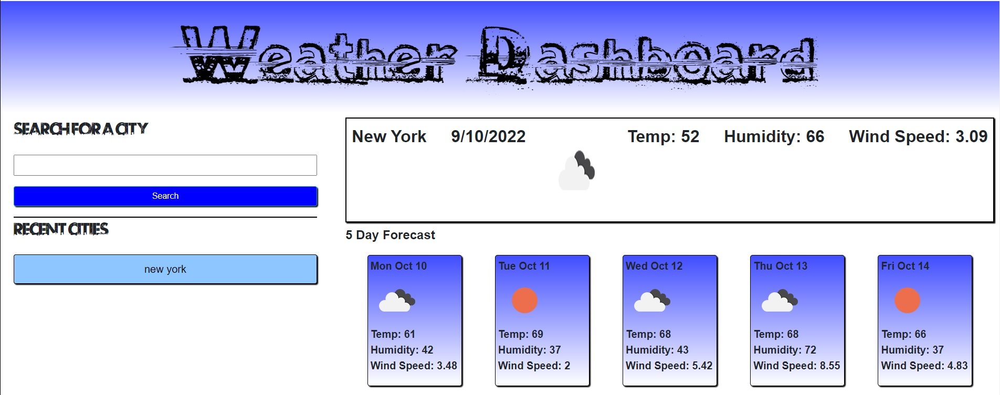

# weather-dashboard

https://jaxpi.github.io/weather-dashboard/
 

## Description

This application was created for travelers to use in order to quickly and easily see the current and near-future weather conditions for cities around the world so they can plan properly for their trip. Users can type in a city name and submit which will bring up the current temperature, weather, wind speed, and humidity of the location as well as the same conditions for the following 5 days.

## Usage

Users type in the city name in the form box beneath "Search for a City." Upon pressing enter or clicking the saerch button the weather information will be displayed. That city will be added to the list of recent cities so the user can simply click on the city name there to see the weather if they refresh the page or close it and want to check again at a later time. If the user wishes to view this application on their phone or tablet the page layout will adapt dynamically to retain a clear representation of the information.

## License

MIT License

Copyright (c) 2022 Jackson Impellizeri

Permission is hereby granted, free of charge, to any person obtaining a copy
of this software and associated documentation files (the "Software"), to deal
in the Software without restriction, including without limitation the rights
to use, copy, modify, merge, publish, distribute, sublicense, and/or sell
copies of the Software, and to permit persons to whom the Software is
furnished to do so, subject to the following conditions:

The above copyright notice and this permission notice shall be included in all
copies or substantial portions of the Software.

THE SOFTWARE IS PROVIDED "AS IS", WITHOUT WARRANTY OF ANY KIND, EXPRESS OR
IMPLIED, INCLUDING BUT NOT LIMITED TO THE WARRANTIES OF MERCHANTABILITY,
FITNESS FOR A PARTICULAR PURPOSE AND NONINFRINGEMENT. IN NO EVENT SHALL THE
AUTHORS OR COPYRIGHT HOLDERS BE LIABLE FOR ANY CLAIM, DAMAGES OR OTHER
LIABILITY, WHETHER IN AN ACTION OF CONTRACT, TORT OR OTHERWISE, ARISING FROM,
OUT OF OR IN CONNECTION WITH THE SOFTWARE OR THE USE OR OTHER DEALINGS IN THE
SOFTWARE.

